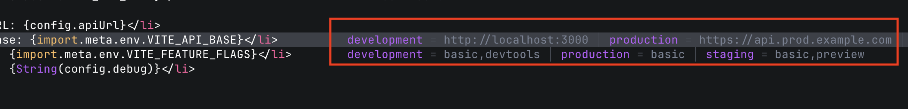

# viteenv.nvim

Inline lens for Vite environment variables. Shows the **effective value** of
`import.meta.env.VITE_X` per mode, resolved by your project's own Vite.



## How it works

```
 ┌────────────┐   import.meta.env.VITE_X spotted   ┌─────────────────┐
 │  Neovim    │ ────────────────────────────────▶ │  Node sidecar    │
 │  (Lua)     │   {root, mode} request (JSON)      │  (sidecar/       │
 │            │ ◀──────────────────────────────── │   worker.mjs)    │
 │  renders   │   {env, define, ...} response      │  uses PROJECT's  │
 │  virt_text │                                    │  vite, mtime gate│
 └────────────┘                                    └─────────────────┘
```

- **Resolution is delegated to the project's Vite** (not reimplemented), so it
  stays correct across Vite versions.
- A **resident worker** keeps Vite imported once; warm resolves cost ~2–7 ms.
- An **mtime gate** re-resolves only when `vite.config` / `.env*` actually
  change; unchanged queries cost ~0.02 ms.
- **Failures are structured**, and the plugin degrades gracefully (stale / off)
  instead of erroring.
- **Live** — a filesystem watcher refreshes the lens when `.env*` /
  `vite.config` change, no keypress needed.

## Requirements

- Neovim 0.10+ (extmarks / `vim.system`)
- Node.js 18+ available on `PATH`
- A project where **Vite is resolvable from the project root** via Node's module
  resolution — i.e. reachable in `node_modules` from the root upward (the
  project's own install, or a hoisted one in a monorepo). The sidecar uses that
  Vite; nothing is bundled, and a global Vite is never used.

## Installation

```lua
{ "harukikuri/viteenv.nvim", opts = {} }
```

## Configuration

Defaults shown; pass only what you want to override.

```lua
require("viteenv").setup({
  -- Filetypes the lens attaches to.
  filetypes = { "javascript", "javascriptreact", "typescript", "typescriptreact", "vue", "svelte" },

  -- Limit which modes are shown. nil / empty = every auto-discovered mode
  -- (package.json `--mode` scripts + `.env.<mode>` files). A list filters that
  -- set, e.g. { "development", "production" }.
  mode = nil,

  -- Inline rendering (end-of-line virtual text showing every shown mode).
  lens = {
    collapse = true,       -- when all shown modes share a value, show it once
    padding = 8,           -- spaces between end of code and the annotation
    prefix = "= ",         -- separator before a single/collapsed value
    separator = " │ ",     -- divider between modes when they differ
    max_value_len = 60,    -- truncate a single/collapsed value
    mode_value_len = 32,   -- truncate each value in the per-mode (differing) view
    mask = { "SECRET", "TOKEN", "PASSWORD", "PRIVATE" }, -- substrings -> value masked
    mode_labels = {},      -- e.g. { development = "dev", production = "prod" }
    highlights = {         -- plugin's own groups; override with :hi or repoint
      value = "ViteEnvValue",
      mode = "ViteEnvMode",
      separator = "ViteEnvSeparator",
      stale = "ViteEnvStale",       -- last-good shown while refreshing
      missing = "ViteEnvMissing",   -- referenced VITE_X not set
    },
  },

  -- Node sidecar.
  sidecar = {
    node_path = nil,       -- absolute path to node; nil = "node" on PATH
    startup_timeout_ms = 5000,
    request_timeout_ms = 10000,
    restart_backoff_ms = { 200, 400, 800, 1600, 3200 },
    max_restarts = 5,      -- consecutive failures before the breaker trips
    healthy_reset_ms = 10000,
  },

  log_level = "warn",      -- "trace"|"debug"|"info"|"warn"|"error"|"off"
})
```
